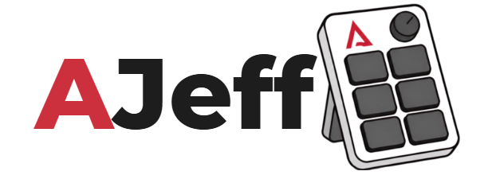
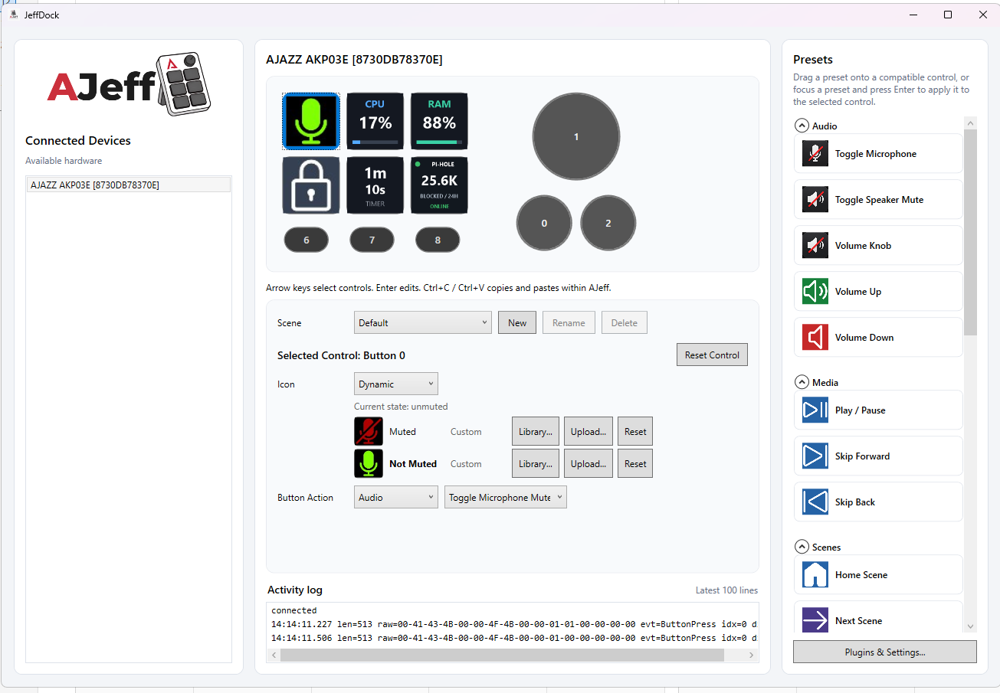

# AJeff



[](https://github.com/ryerac/AJeff/actions/workflows/ci.yml)

AJeff is a small Windows portable app for configuring AJAZZ macro pads without
relying on the vendor application. A project born out of an evening of simply not wanting to use the official software.

It discovers supported devices over USB HID, presents their controls in a visual
editor, and lets you turn buttons and dials into useful desktop actions.

The aim is **deliberately simple**: provide the functionality needed for everyday
use in one auditable, portable application, without requiring an account, cloud
service, marketplace, or wider software ecosystem.

That narrow scope will not suit everyone. For Linux, broader device coverage,
or a more extensible Stream Deck-compatible environment, consider
[OpenDeck](https://github.com/nekename/OpenDeck) or the Linux-focused
[OpenDeck AJAZZ fork](https://github.com/mistweaverco/opendeck-ajazz). For more
advanced automation, live telemetry, multiple hosts, and a wider plugin
ecosystem, see [JIB — Jack In the Box](https://androme13.github.io/JIB/) which may suit your needs much better than this.

The name is a small chain of wordplay: AJAZZ → jazz → Jazzy Jeff → AJeff.  Pointlessly stupid names is the best bit of any new project.




> [!IMPORTANT]
> AJeff is an early-stage community project. Expect rough edges and changes to
> settings, plugin APIs, and device support while the project matures.

> [!IMPORTANT]
> Zero warranty is implied, this was heavily human instructed, but essentially implemented by AI. 
> It simply renders data over HID and whilst it works with my device, I take no responsibility for you breaking your own devices.

## What it can do

- Detect supported AJAZZ devices over USB HID
- Configure buttons, dial presses, and dial turns
- Control speaker volume and speaker or microphone mute state
- Send media keys and keyboard shortcuts
- Organise layouts into named scenes and switch between them from the device
- Choose bundled icons (See credits), recolour SVG icons, or upload your own artwork
- Show state-aware icons for actions such as mute
- Extend the action palette through plugins
- Optionally start with Windows and launch minimised

AJeff stores bindings and settings locally in a local `%APPDATA%/Jeffdock` folder. Its built-in actions do not require an online account or cloud service.

## Supported hardware

Windows only.

The currently included device profile is:

- AJAZZ AKP03E (`VID 0x0300`, `PID 0x3002`)

Other models may use different USB protocols even when they look similar. They
need their own tested device profile before they can be considered supported.
If you have an AJAZZ, please feel free to create a discussion so we can add the profile! Heck, it may even work with other chinese-marketplace pads which operate in the same way!

## Included plugins

AJeff currently bundles a small set of trusted, in-process plugins:

- **Mouse Mover** — Simplistic mouse jiggle. Periodically nudges the pointer
- **Timer** — provides timer actions and visual state.
- **Fun** (?) — provides a simple built-in game helpers - Dice roller (D6 only at time of writing) and a coin flip.
- **[Pi-hole Monitor](JeffDock.Plugins/JeffDock.Plugins.PiHole/README.md)** — monitors Pi-hole v6 availability and blocked-query counts for the last 24hr
- **[System](JeffDock.Plugins/JeffDock.Plugins.System/README.md)** — locks or sleeps Windows and launches apps or trusted commands

Plugins run with the same permissions as AJeff. Currently all plugins are part of this repo (Rather than sub-repos), although nothing is stopping someone writing their own - Once the package is published for the interfaces.

## Project status

AJeff is mostly functional and supports the core workflow: detecting a compatible
device, assigning actions, managing scenes, updating button artwork, and loading
plugins. It is still an early-stage project with basic functionality and an
unstyled, utilitarian user experience. Expect rough edges and changes while the
interaction model is refined.

The application currently targets Windows and .NET 10. Hardware behaviour should
be treated as model-specific; reports from real devices are especially valuable.
No plans to target Linux currently, as there are already options for that platform.

## Roadmap

The current priorities are:

- Improve the visual design and general usability of the editor
- Make device setup, action assignment, and plugin configuration clearer
- Harden portable releases, upgrades, diagnostics, and error handling
- Expand the built-in action and plugin selection
- Add support for more devices as their USB protocols can be tested
- Stabilise configuration formats and the plugin API as the project matures

This roadmap describes the intended direction rather than committed release
dates or guarantees.

## Get AJeff

> [!IMPORTANT]
> Fully close the AJAZZ software before starting AJeff. The vendor application
> otherwise retains ownership of the device connection and prevents AJeff from
> connecting to the macro pad.

Download `AJeff.exe` from the
[latest GitHub Release](https://github.com/ryerac/AJeff/releases/latest). AJeff is
portable: place the executable wherever you want and run it without an
installer or a separate .NET installation. Release downloads also include a
SHA-256 checksum file for verifying the executable.

Alternatively, install the .NET 10 SDK, clone this repository, and build the
same self-contained Windows x64 executable locally:

```powershell
dotnet publish .\JeffDock.App\JeffDock.App.csproj -p:PublishProfile=win-x64-single-file
```

The locally built `AJeff.exe` is written beneath
`JeffDock.App\bin\Release\net10.0-windows\win-x64\publish`. It includes the .NET
runtime and all official plugins. Optional third-party plugins can be placed in
`%LOCALAPPDATA%\JeffDock\Plugins`.

## Documentation

Additional guides are collected in the [documentation index](docs/README.md),
including plugin packaging and user-data locations.


## FAQ

### Why does it look so bad?
Its basic. It was mostly made by robots, and WPF doesn't offer the same level as fancy as most modern app development without a lot more effort, simple. I may throw some UX effort in later.

### Docs/Guides?
Not yet, its fairly self explanitory but a proper guide is on the cards if anyone actually uses this.


## Contributing

Bug reports, device protocol findings, focused fixes, and new device profiles are
welcome. See [CONTRIBUTING.md](CONTRIBUTING.md) for the development setup and
project structure.

When reporting a hardware issue, include the exact model name and USB VID/PID if
possible. Avoid posting device serial numbers or other personal information.

## Acknowledgements

The bundled Elgato icon set comes from
[elgatosf/icons](https://github.com/elgatosf/icons) and is distributed under its
MIT licence. Its pinned version and licence text are included with the assets.

AJeff is an independent community project and is not affiliated with or
endorsed by AJAZZ or Elgato.
